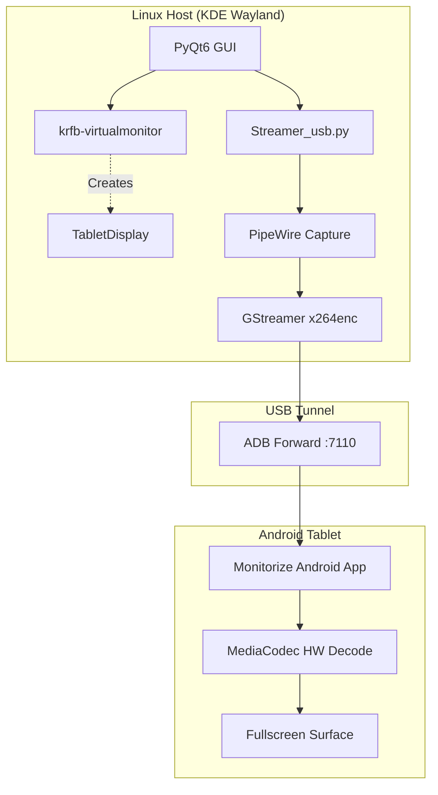

<div align="center">
  <h1>🖥️ Monitorize</h1>
  <p><strong>A modern, low-latency secondary monitor solution for Linux — powered by PyQt6 and GStreamer.</strong></p>

  [](https://www.gnu.org/licenses/gpl-3.0)
  [](#)
  [](#)
  [](#)
</div>

---

## 📖 Overview

**Monitorize** allows you to use your Android tablet as a high-performance secondary display for your Linux desktop (specifically tuned for KDE Plasma/Wayland). Unlike other solutions, it focuses on **ultra-low latency** by using a direct USB tunnel via ADB, bypassing unstable Wi-Fi connections.

It now features a sleek **PyQt6 Control Panel** that automates the setup, handles port forwarding, and provides real-time logging.

### ✨ Key Features
- **Modern GUI**: Step-by-step wizard for easy connection.
- **Dynamic Settings**: Choose your Resolution (up to 4K) and FPS (up to 120Hz) directly in the app.
- **Auto-ADB**: Automatically handles device detection and port forwarding.
- **Low Latency**: Uses `x264enc` with `zerolatency` tuning for immediate response.
- **Hardware-Agnostic**: Runs on CPU encoding for maximum reliability across Intel, AMD, and NVIDIA systems.

---

## 🏗️ Architecture



---

## 🛠️ Prerequisites

### Linux Host
| Package | Description |
|---------|-------------|
| `PyQt6` | The desktop GUI framework |
| `krfb` | Required for creating the virtual monitor |
| `gstreamer1` | Plugins: `base`, `good`, `bad`, `ugly` (for x264enc) |
| `android-tools` | For ADB functionality |
| `python3-dbus` | For PipeWire/Portal communication |

### Android Tablet
- **Android 9+**
- **USB Debugging Enabled** (Developer Options)
- **Monitorize Android App** installed

---

## 🚀 Getting Started

### 1. Launch the Control Panel
Navigate to the `linux/` directory and run the GUI:
```bash
python3 monitorize_gui.py
```

### 2. The USB Mode Wizard
1.  **Select USB Mode**: Follow the on-screen prompts.
2.  **Connect Tablet**: The app will automatically run `adb devices` and set up the port forward.
3.  **Configure Display**: Select your preferred **Resolution** and **FPS**.
    > [!IMPORTANT]
    > Ensure the Resolution and FPS match exactly what you've set in the Android app.
4.  **Start Streaming**:
    - Tap **Receive** on your Android tablet first.
    - Click **Start Streaming** in the GUI.
    - When the KDE share prompt appears, select **TabletDisplay** and click **Share**.

---

## 📁 Project Structure

- `linux/monitorize_gui.py`: The main entry point for the desktop app.
- `linux/Streamer_usb.py`: The high-performance GStreamer backend.
- `android/`: Full source code for the high-performance Android receiver app.
- `linux/monitorize_fallback.py`: A CLI-only version of the streamer for debugging.

---

## 📄 License
Licensed under the **GNU General Public License v3.0**.

<div align="center">
  <sub>Built by Vinnavan | Expanding your productivity, one monitor at a time.</sub>
</div>
