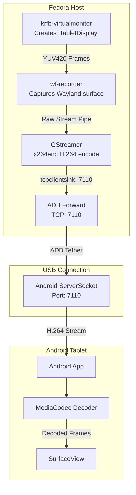

<div align="center">
  <h1>🚀 Monitorize</h1>
  <p><strong>A zero-lag, USB-tethered secondary display solution for Linux hosts and Android tablets.</strong></p>
  
  [](https://www.gnu.org/licenses/gpl-3.0)
  [](#)
  [](#)
</div>

---

## 📖 Overview

**Monitorize** transforms your Android tablet into a high-performance secondary monitor for your Linux desktop. Built for modern Linux environments (Wayland) and Android devices, it leverages native APIs and hardware acceleration to deliver a buttery-smooth 60fps experience via a simple USB connection. No Wi-Fi dependency. No bloat. Just a seamless multi-monitor experience.

Think of it as *Spacedesk* or *Duet Display*, but crafted explicitly for Linux and Android power users.

### 🌟 Key Features

- **⚡ Zero-Lag USB Transport**: Uses ADB reverse/forward port tunneling for uninterrupted, high-bandwidth video streaming over a wired USB connection.
- **🖥️ Native Wayland Integration**: Uses `krfb-virtualmonitor` to create a virtual display in KDE Plasma that acts exactly like a physical monitor.
- **🎥 Hardware Accelerated Encoding**: Utilizes `wf-recorder` and GStreamer (`x264enc`) to capture and encode Wayland surfaces efficiently without hogging host CPU.
- **📱 Native Android Decoding**: The companion Android app decodes raw H.264 streams directly via `MediaCodec` and renders to a `SurfaceView` for minimal latency.
- **🔋 Battery & Resource Efficient**: Bypasses Wi-Fi overhead and unnecessary touch input loops, focusing purely on high-fidelity display extension.

---

## 🏗️ Architecture

The system operates in a Host-Client model connected via an ADB USB tether.



---

## 🛠️ Prerequisites

### Host (Linux)
- **OS**: Fedora (or any modern distribution running Wayland / KDE Plasma).
- **GPU**: Supports Hybrid Graphics (e.g., Intel iGPU + AMD/Nvidia dGPU).
- **Dependencies**: 
  - `krfb-virtualmonitor` (for virtual monitor creation)
  - `wf-recorder` (Wayland screen recorder)
  - `gstreamer1` & `gstreamer1-plugins-bad-free` (for encoding and streaming)
  - `android-tools` (for ADB)

### Client (Android)
- **OS**: Android 14+ (Tested on Samsung Galaxy Tab S7 FE / One UI).
- **Requirements**: USB Debugging enabled in Developer Options.

---

## 🚀 Quick Start Setup

### 1. Host Configuration (Fedora KDE)

1. Create a virtual display using KDE's Virtual Monitor feature:
   ```bash
   krfb-virtualmonitor --name "TabletDisplay" --resolution 2560x1600
   ```
2. Open your KDE Display Settings. You will see a new monitor named `TabletDisplay`. Position it alongside your primary screen just like a physical monitor.

### 2. Connect Your Tablet

1. Connect the Android tablet to your Linux host via a high-quality USB cable.
2. Ensure **USB Debugging** is enabled on the tablet and allow the connection from your computer.
3. Forward the TCP port using ADB:
   ```bash
   adb forward tcp:7110 tcp:7110
   ```

### 3. Launch the Android App

1. Build the Android app located in the `/android` directory using Android Studio or Gradle, and install it on your tablet.
2. Open the **Monitorize** app. It will immediately begin listening on port `7110` for an incoming H.264 stream.

### 4. Start the Stream

Pipe the Wayland display output through `wf-recorder` into GStreamer to stream the video directly to the tablet:

```bash
wf-recorder -o "TabletDisplay" -c rawvideo -m v4l2 -x yuv420p -f - | \
gst-launch-1.0 fdsrc ! rawvideoparse use-sink-caps=false width=2560 height=1600 format=i420 framerate=60/1 ! \
x264enc tune=zerolatency bitrate=8000 speed-preset=ultrafast ! \
h264parse ! tcpclientsink host=127.0.0.1 port=7110
```

> **Pro-Tip:** You can adjust the `bitrate=8000` parameter depending on your USB connection quality and required visual fidelity.

---

## 🧠 Why USB Over Wi-Fi?
Wi-Fi introduces latency spikes and packet loss that significantly degrade a desktop experience. A hardwired USB connection ensures consistent frame delivery, minimizes host encoder back-pressure, and provides a true, responsive monitor-like feel with zero perceivable lag.

---

## 📄 License

This project is licensed under the **GNU General Public License v3.0 (GPLv3)**. This ensures the project remains free and open source. See the `LICENSE` file for more details.

---

<div align="center">
  <sub>Built with ❤️ by Vinnavan | Expanding your digital workspace, one pixel at a time.</sub>
</div>
